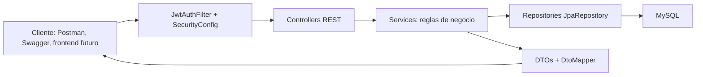

# Guia de examen del repo

Esta carpeta esta pensada para estudiar y defender el proyecto. El repo es una API REST backend para un e-commerce de productos Apple, implementada con Java, Spring Boot, Spring Data JPA, MySQL y seguridad JWT.

## Como estudiar esta carpeta

1. Lee este archivo para tener el mapa general.
2. Usa `mapa-archivos.md` cuando te pregunten "donde esta implementado X".
3. Usa `arquitectura.md` para explicar capas, paquetes y recorrido de una request.
4. Usa `modelo-datos.md` para explicar entidades, tablas y relaciones.
5. Usa `flujos.md` para explicar login, JWT, carrito y checkout.
6. Usa `endpoints-pruebas.md` para endpoints, Postman, Swagger y tests.
7. Usa `guion-defensa.md` para practicar una explicacion oral de 2, 5 o 10 minutos.
8. Usa `preguntas-examen.md` para practicar respuestas puntuales.

Los diagramas Mermaid tambien estan separados en `docs/examen/diagramas/*.mmd` por si queres pegarlos en un visor Mermaid o en una presentacion.

## Respuesta corta: que tecnologia usamos

Usamos Java 17 con Spring Boot 4.0.5 para construir una API REST. La persistencia esta hecha con Spring Data JPA/Hibernate contra MySQL 8 en desarrollo y Docker, y H2 en tests. La seguridad usa Spring Security en modo stateless con JWT firmado mediante JJWT. Para reducir codigo repetitivo usamos Lombok. La documentacion interactiva de la API esta con Springdoc OpenAPI/Swagger. El proyecto se construye con Maven, se puede levantar con Docker Compose, tiene una coleccion de Postman y tests con JUnit, Mockito, MockMvc, Spring Security Test y reporte JaCoCo.

## Stack tecnico

| Tema | Tecnologia | Donde verlo |
|---|---|---|
| Lenguaje | Java 17 | `pom.xml` |
| Framework principal | Spring Boot 4.0.5 | `pom.xml`, `src/main/java/com/apple/tpo/e_commerce/ECommerceApplication.java` |
| API REST | Spring Web MVC | `src/main/java/com/apple/tpo/e_commerce/controller/` |
| Persistencia | Spring Data JPA + Hibernate | `src/main/java/com/apple/tpo/e_commerce/respository/`, `src/main/java/com/apple/tpo/e_commerce/model/` |
| Base de datos | MySQL, H2 para tests | `application.properties`, `application-docker.properties`, tests con propiedades H2 |
| Seguridad | Spring Security + JWT | `SecurityConfig.java`, `JwtAuthFilter.java`, `JwtService.java` |
| Validacion | Jakarta Validation | `LoginRequest.java`, `RegisterRequest.java`, `GlobalExceptionHandler.java` |
| DTOs y mapeo | DTOs propios + `DtoMapper` | `src/main/java/com/apple/tpo/e_commerce/dto/`, `DtoMapper.java` |
| Documentacion API | Springdoc OpenAPI / Swagger UI | `OpenApiJwtConfig.java`, `/swagger-ui/index.html` |
| Contenedores | Dockerfile multi-stage + Docker Compose | `Dockerfile`, `docker-compose.yml` |
| Tests | JUnit 5, Mockito, MockMvc, Spring Security Test | `src/test/java/` |
| Cobertura | JaCoCo | `pom.xml`, `target/site/jacoco/index.html` luego de correr tests |

## Frase para explicar la arquitectura

La app esta separada en capas: los controllers exponen endpoints REST, los services concentran reglas de negocio y transacciones, los repositories abstraen el acceso a datos con Spring Data JPA, las entities modelan las tablas y los DTOs definen lo que entra y sale por la API. La seguridad se aplica antes de llegar a los controllers mediante un filtro JWT y reglas de autorizacion configuradas en `SecurityConfig`.



## Flujo mental de una request

1. El cliente llama a un endpoint, por ejemplo `GET /api/productos`.
2. Spring Security revisa si el endpoint requiere token.
3. Si hay token Bearer, `JwtAuthFilter` extrae el email y valida el JWT.
4. El controller recibe la request y delega al service.
5. El service aplica reglas de negocio y usa repositories.
6. El repository consulta o guarda entities en MySQL.
7. `DtoMapper` convierte entities a DTOs de respuesta.
8. El controller devuelve JSON.

## Lo mas importante para defender

| Si preguntan | Respuesta breve | Archivo clave |
|---|---|---|
| Como arranca la app | Con `@SpringBootApplication` y `SpringApplication.run` | `ECommerceApplication.java` |
| Como se exponen endpoints | Con `@RestController`, `@RequestMapping`, `@GetMapping`, etc. | `controller/` |
| Donde esta la logica de negocio | En services; el caso mas importante es checkout | `CarritoService.java` |
| Como se guarda en DB | Repositories extienden `JpaRepository` y JPA mapea entities a tablas | `respository/`, `model/` |
| Como funciona login | `AuthController` llama a `AuthService`, se autentica y genera JWT | `AuthService.java`, `JwtService.java` |
| Como se protegen endpoints | `SecurityConfig` define reglas y agrega `JwtAuthFilter` | `SecurityConfig.java` |
| Como se evita devolver password | `UsuarioResponse` no tiene password y `DtoMapper` no lo mapea | `UsuarioResponse.java`, `DtoMapper.java` |
| Como se maneja un error | Excepciones propias + `GlobalExceptionHandler` devuelven `ApiResponse` | `exception/`, `ApiResponse.java` |
| Como se hace checkout | Valida carrito activo, items, stock, crea orden, detalles y descuenta stock | `CarritoService.checkout` |
| Como se prueba | Unit tests con Mockito, integracion con MockMvc y H2 | `src/test/java/` |

## Comandos utiles

```powershell
.\mvnw.cmd test
```

```powershell
.\mvnw.cmd spring-boot:run
```

```powershell
docker compose up -d --build
```

URLs al levantar:

| Recurso | URL |
|---|---|
| API | `http://localhost:8080` |
| Swagger | `http://localhost:8080/swagger-ui/index.html` |
| OpenAPI JSON | `http://localhost:8080/v3/api-docs` |
| Health | `http://localhost:8080/actuator/health` |

Credenciales seed:

| Rol | Email | Password |
|---|---|---|
| Admin | `admin@apple-ar.com` | `password` |
| User | `carlos@email.com` | `password` |
| User | `lucia@email.com` | `password` |
