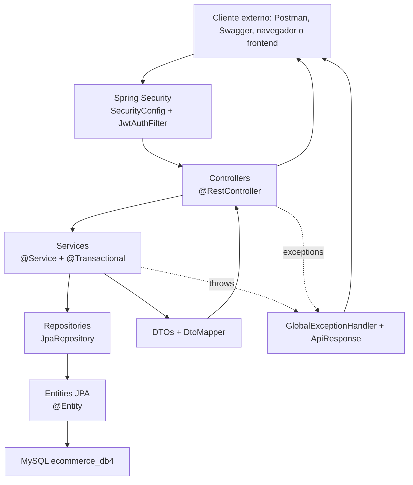
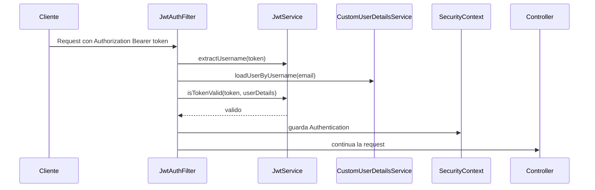

# Arquitectura

El proyecto sigue una arquitectura por capas tipica de Spring Boot. Cada paquete tiene una responsabilidad clara y el flujo normal es controller -> service -> repository -> database, con DTOs para entrada/salida y seguridad aplicada antes de llegar al controller.

## Paquetes principales

```text
src/main/java/com/apple/tpo/e_commerce
|-- config        Configuracion de seguridad y OpenAPI
|-- controller    Endpoints REST
|-- dto           Objetos request/response de la API
|-- exception     Excepciones propias y handler global
|-- mapper        Conversion de entities a DTOs
|-- model         Entidades JPA y enum Role
|-- respository   Interfaces JpaRepository
|-- security      JWT filter, JWT service y handlers 401/403
|-- service       Logica de negocio y transacciones
```

## Diagrama de capas



## Responsabilidad por capa

| Capa | Responsabilidad | Ejemplo |
|---|---|---|
| Controller | Recibir HTTP, leer path/body, devolver response | `ProductoController.getAllProductos` |
| Service | Reglas de negocio, validaciones y transacciones | `CarritoService.checkout` |
| Repository | Acceso a datos sin SQL manual para CRUD | `ProductoRepository extends JpaRepository` |
| Model | Entidades persistidas por JPA | `Producto`, `Usuario`, `Carrito` |
| DTO | Contrato externo de la API | `ProductoRequest`, `ProductoResponse` |
| Mapper | Convertir entity a DTO sin exponer datos internos | `DtoMapper.toUsuarioResponse` |
| Security | Autenticacion, autorizacion, JWT, handlers 401/403 | `SecurityConfig`, `JwtAuthFilter` |
| Exception | Unificar errores en JSON | `GlobalExceptionHandler`, `ApiResponse` |

## Recorrido de `GET /api/productos`

1. El cliente llama `GET /api/productos`.
2. `SecurityConfig` exige autenticacion para `/api/productos/**`.
3. `JwtAuthFilter` busca el header `Authorization`.
4. Si hay token valido, el request sigue a `ProductoController`.
5. `ProductoController.getAllProductos` delega en `ProductoService.getAllProductos`.
6. `ProductoService` llama a `productoRepository.findAll()`.
7. Spring Data JPA trae entities `Producto`.
8. `DtoMapper.toProductoResponseList` arma DTOs.
9. El controller devuelve JSON.

## Por que usamos DTOs

Los DTOs evitan acoplar la API directamente a las entities. Esto permite:

- No devolver `password` de `Usuario`.
- Controlar que campos entran en cada request.
- Evitar ciclos infinitos en relaciones bidireccionales.
- Dejar un contrato mas estable aunque cambie el modelo interno.

Ejemplo importante: `Usuario` tiene password, pero `UsuarioResponse` no. El mapeo en `DtoMapper.toUsuarioResponse` solo copia id, username, email, nombre, apellido y role.

## Seguridad dentro de la arquitectura

La seguridad no esta dentro de cada controller, sino configurada de forma transversal:



## Convenciones visibles en el repo

- Las entities usan `@Entity`, `@Table` y `@Id`.
- Los services usan `@Service` y `@Transactional`.
- Los repositories extienden `JpaRepository<Entity, Long>`.
- La mayoria de controllers usa `@Autowired`; `AuthController` usa constructor con Lombok `@RequiredArgsConstructor`.
- Los DTOs usan Lombok `@Data`.
- Los errores de negocio se expresan con excepciones propias, no con respuestas manuales en cada service.
