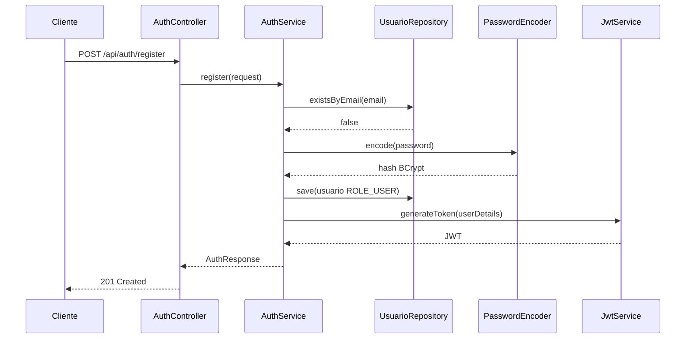
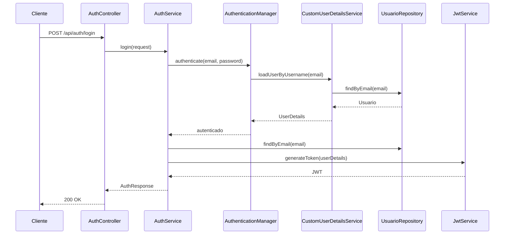
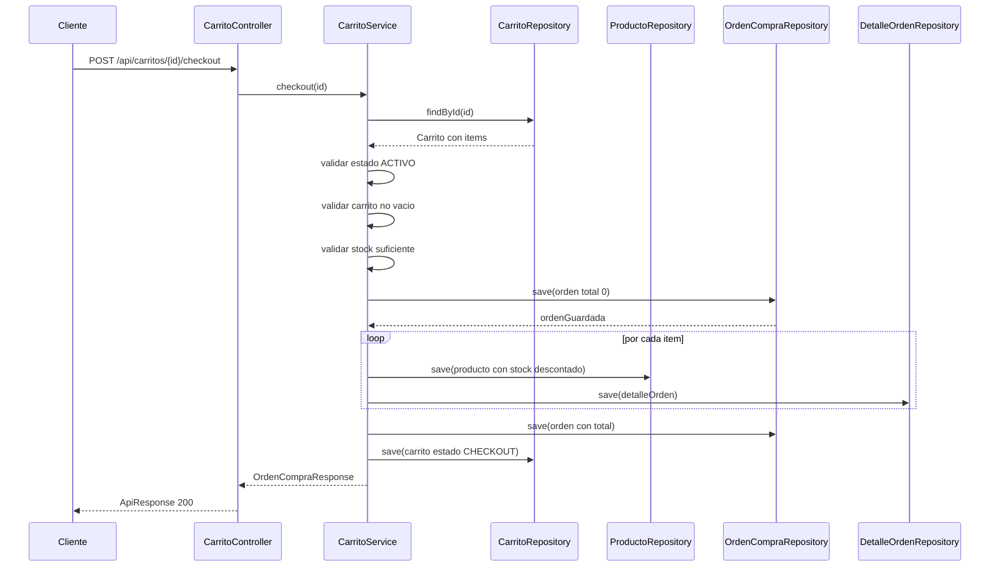

# Flujos principales

Este archivo resume los flujos que mas probablemente te pidan explicar: registro/login, uso del token, creacion de items y checkout.

## Registro

Endpoint: `POST /api/auth/register`

Implementacion:

- Controller: `AuthController.register`
- Service: `AuthService.register`
- Repository: `UsuarioRepository`
- JWT: `JwtService.generateToken`

Pasos:

1. Llega un `RegisterRequest` con `username`, `email`, `password`, `nombre`, `apellido`.
2. `@Valid` ejecuta validaciones de `@NotBlank` y `@Email`.
3. `AuthService` verifica `usuarioRepository.existsByEmail`.
4. Si el email existe, lanza `ConflictException` y responde 409.
5. Si no existe, crea `Usuario`.
6. Hashea password con `BCryptPasswordEncoder`.
7. Asigna rol por defecto `ROLE_USER`.
8. Guarda el usuario.
9. Genera JWT con subject igual al email.
10. Devuelve `AuthResponse(token, email, role)`.



## Login

Endpoint: `POST /api/auth/login`

Pasos:

1. Llega `LoginRequest` con email y password.
2. `AuthService.login` llama a `AuthenticationManager.authenticate`.
3. Spring Security usa `CustomUserDetailsService` para buscar usuario por email.
4. `DaoAuthenticationProvider` compara password usando BCrypt.
5. Si autentica, `AuthService` busca el usuario y genera JWT.
6. Devuelve `AuthResponse`.



## Request protegida con JWT

Ejemplo: `GET /api/productos`

1. El cliente manda header `Authorization: Bearer <token>`.
2. `JwtAuthFilter` toma el header.
3. Extrae el token sin el prefijo `Bearer `.
4. `JwtService.extractUsername` lee el subject del token.
5. `CustomUserDetailsService` busca el usuario por email.
6. `JwtService.isTokenValid` compara subject y expiracion.
7. Si es valido, se carga `Authentication` en `SecurityContextHolder`.
8. Spring permite llegar al controller.

## Crear item de carrito

Endpoint: `POST /api/items-carrito`

Implementacion: `ItemCarritoService.createItem`

Reglas:

- `carritoId` es obligatorio.
- `productoId` es obligatorio.
- `cantidad` debe ser mayor a 0.
- El carrito debe existir.
- El producto debe existir.
- `precioUnitario` se toma desde `producto.getPrecio()`.
- `subtotal = precio * cantidad`.

Importante para examen: el stock no se descuenta al agregar al carrito. Se descuenta recien en checkout.

## Checkout

Endpoint: `POST /api/carritos/{id}/checkout`

Implementacion central: `CarritoService.checkout`

Pasos exactos:

1. Busca el carrito por id.
2. Verifica que el estado sea `ACTIVO`.
3. Verifica que tenga items.
4. Recorre items y valida stock suficiente por producto.
5. Crea `OrdenCompra` con estado `COMPLETADA`, total inicial 0 y fecha actual.
6. Guarda la orden para obtener id.
7. Por cada item:
   - descuenta stock del producto;
   - guarda producto actualizado;
   - crea `DetalleOrden`;
   - acumula total.
8. Actualiza total de la orden.
9. Asocia detalles a la orden.
10. Cambia estado del carrito a `CHECKOUT`.
11. Devuelve `OrdenCompraResponse`.



## Manejo de errores

Los services lanzan excepciones y `GlobalExceptionHandler` las transforma en JSON.

| Caso | Excepcion | HTTP |
|---|---|---|
| Recurso inexistente | `ResourceNotFoundException` | 404 |
| Regla de negocio invalida | `BusinessException` | 400 |
| Email duplicado | `ConflictException` | 409 |
| Credenciales invalidas | `InvalidCredentialsException` o `AuthenticationException` | 401 |
| Validacion de DTO fallida | `MethodArgumentNotValidException` | 400 |
| Error inesperado | `Exception` | 500 |

Formato de error:

```json
{
  "timestamp": "...",
  "status": 400,
  "success": false,
  "message": "Validacion fallida",
  "data": ["email: debe ser un email valido"]
}
```

