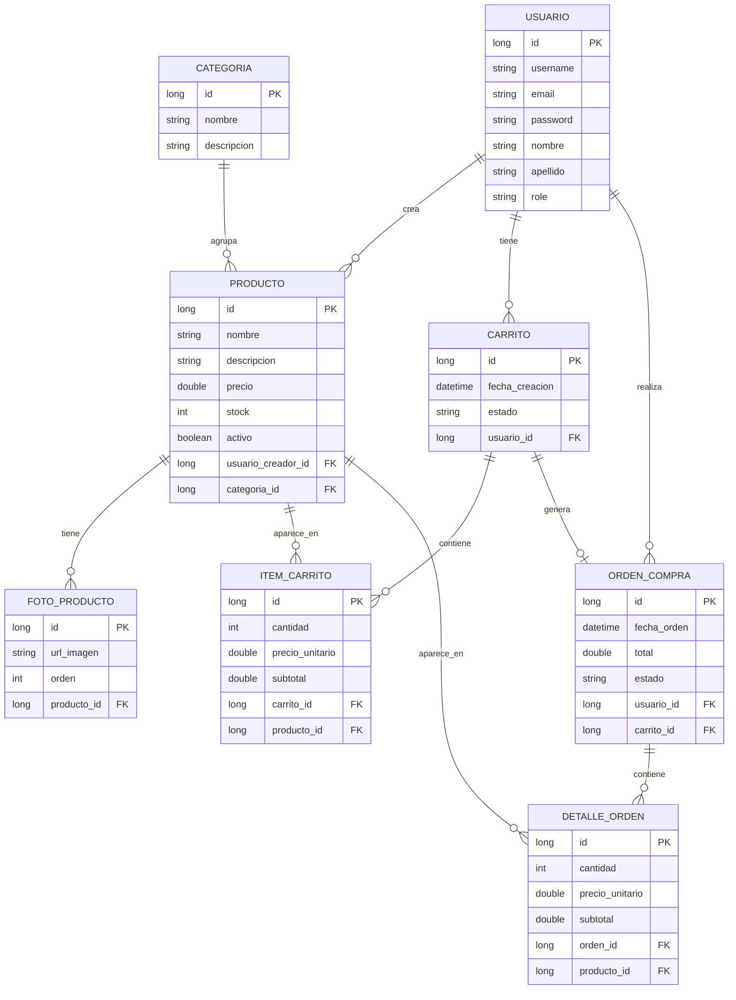

# Modelo de datos

El modelo se implementa con entidades JPA en `src/main/java/com/apple/tpo/e_commerce/model/`. Hibernate genera o actualiza las tablas porque `spring.jpa.hibernate.ddl-auto=update`.

## Entidades y tablas

| Entity | Tabla | Proposito |
|---|---|---|
| `Usuario` | `usuarios` | Cuenta del usuario, datos personales, password hasheada y rol |
| `Categoria` | `categorias` | Agrupa productos: Mac, iPhone, iPad, etc. |
| `Producto` | `productos` | Item vendible, precio, stock, activo, categoria y creador |
| `FotoProducto` | `fotos_producto` | URLs de imagenes asociadas a un producto |
| `Carrito` | `carritos` | Carrito de compra de un usuario, con estado |
| `ItemCarrito` | `items_carrito` | Producto y cantidad dentro de un carrito |
| `OrdenCompra` | `ordenes_compra` | Compra finalizada, total y estado |
| `DetalleOrden` | `detalles_orden` | Lineas de la orden generadas desde items del carrito |
| `Role` | enum | `ROLE_USER`, `ROLE_ADMIN` |

`Pedido` existe como clase vacia deprecada, pero no tiene `@Entity`, por lo tanto Hibernate no la mapea.

## Diagrama entidad-relacion



## Relaciones importantes en codigo

| Relacion | Implementacion |
|---|---|
| Usuario -> Productos | `Usuario @OneToMany(mappedBy = "usuarioCreador")`, `Producto @ManyToOne usuarioCreador` |
| Usuario -> Carritos | `Usuario @OneToMany(mappedBy = "usuario")`, `Carrito @ManyToOne usuario` |
| Usuario -> Ordenes | `Usuario @OneToMany(mappedBy = "usuario")`, `OrdenCompra @ManyToOne usuario` |
| Categoria -> Productos | `Categoria @OneToMany(mappedBy = "categoria")`, `Producto @ManyToOne categoria` |
| Producto -> Fotos | `Producto @OneToMany(mappedBy = "producto")`, `FotoProducto @ManyToOne producto` |
| Carrito -> Items | `Carrito @OneToMany(mappedBy = "carrito")`, `ItemCarrito @ManyToOne carrito` |
| Carrito -> Orden | `OrdenCompra @OneToOne carrito` |
| Orden -> Detalles | `OrdenCompra @OneToMany(mappedBy = "orden")`, `DetalleOrden @ManyToOne orden` |

## Estados usados

| Objeto | Estados vistos |
|---|---|
| `Carrito` | `ACTIVO`, `CHECKOUT`, comentario tambien menciona `CANCELADO` |
| `OrdenCompra` | `COMPLETADA`, comentario tambien menciona `PENDIENTE`, `CANCELADA` |

Estos estados estan modelados como `String`, no como enum. Si preguntan una mejora, se puede proponer crear enums para evitar errores de tipeo.

## Seed de datos

El seed esta en `src/main/resources/data_seed_startup.sql`.

Incluye:

- 3 usuarios: 1 admin y 2 usuarios normales.
- 6 categorias.
- 20 productos.
- Fotos de productos.
- 2 carritos, uno activo y uno en checkout.
- 1 orden completada con detalles.

La carga se configura en `application.properties`:

```properties
spring.sql.init.mode=always
spring.sql.init.data-locations=classpath:data_seed_startup.sql
```

El script usa `INSERT IGNORE`, entonces es idempotente: no duplica registros si ya existen.

